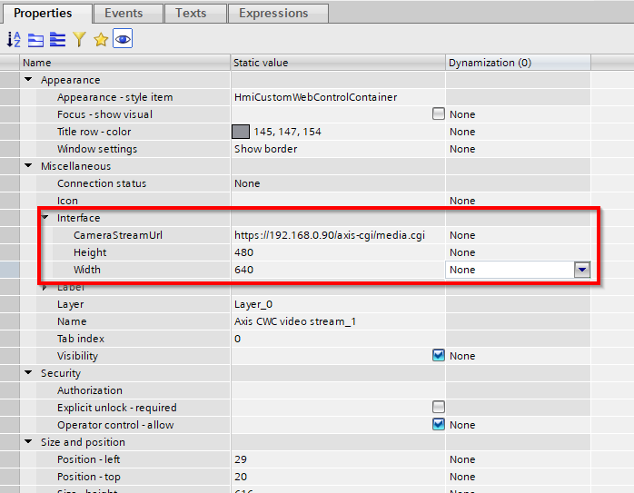
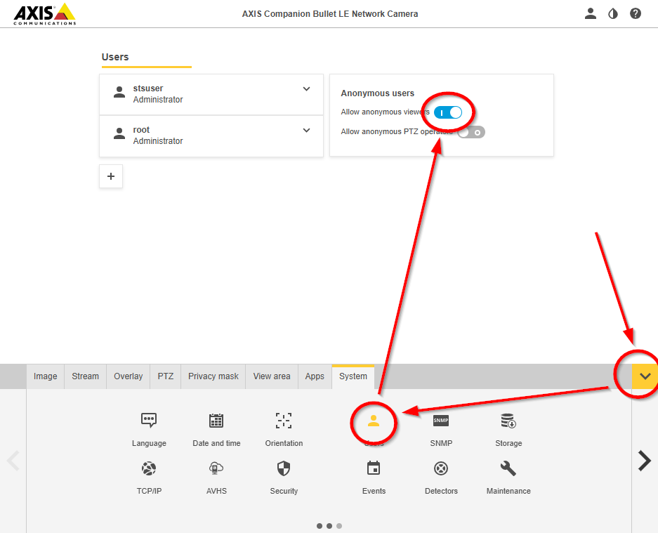

# CWC_HTTPsCamera

## A very basic Custom Web Control (CWC) to to show an HTTPS video stream in WinCC Unified

Icon created by [Freepik - Flaticon](https://www.flaticon.com/free-icons/camera")

## ToDo:

- [x] Get requests by customers
- [x] Find a camera
- [x] Write code
- [x] Debug
- [x] Test on a Unified Comfort Panel
- [x] Debug again
- [x] Write a meaningful documentation
- [ ] Get feedbacks from customers/colleagues

## How to use this CWC (use this if you are in a hurry):

1. Download the [{0f70cb01-2393-4edd-bd1f-29c46e3413de}.zip](build/{0f70cb01-2393-4edd-bd1f-29c46e3413de}.zip) file
2. Copy the **{0f70cb01-2393-4edd-bd1f-29c46e3413de}.zip** file in **C:\Program Files\Siemens\Automation\Portal V1x\Data\Hmi\CustomControls** folder
3. Refresh the **My Controls** right side pane in the TIA Portal WinCC Unified screen editor
4. Enjoy

## How to create a CWC from this stuff (use this if you want to go deeper and/or make some modifications):

1. Download/pull/whatever the code
2. cd in the **{0f70cb01-2393-4edd-bd1f-29c46e3413de}** folder
3. Create **{0f70cb01-2393-4edd-bd1f-29c46e3413de}.zip** file with the **{0f70cb01-2393-4edd-bd1f-29c46e3413de}** folder content
> [!IMPORTANT]
> Do not include the **{0f70cb01-2393-4edd-bd1f-29c46e3413de}** folder itself as root folder in the file zip!
4. Copy the **{0f70cb01-2393-4edd-bd1f-29c46e3413de}.zip** file in **C:\Program Files\Siemens\Automation\Portal V1x\Data\Hmi\CustomControls** folder
5. Refresh the **My Controls** right side pane in the TIA Portal WinCC Unified screen editor
6. Enjoy

## Documentation:

### How does this works?
This CWC (Custom Web Control) requires 3 parameters:

1. the camera URL stream (please, use an HTTPS address)
2. the media stream width, in pixels
3. the media stream height, in pixels

Just populate these information in the TIA Portal bottom side "Properties" pane of the Custom Web Control, build and download the project on the target device:

To avoid User/Password request, if possible, allow anonymous access on your camera:

## I want...

### ... more information on CWCs!
[Here](https://github.com/marcobuffa/CWC_Base) you can find a very basic CWC with some documentation more in order to understand how does this work.

### ... to report a bug, to suggest a new feature, to offer a coffee ;-)
Just write to [marco.buffa@siemens.com](mailto:marco.buffa@siemens.com)
